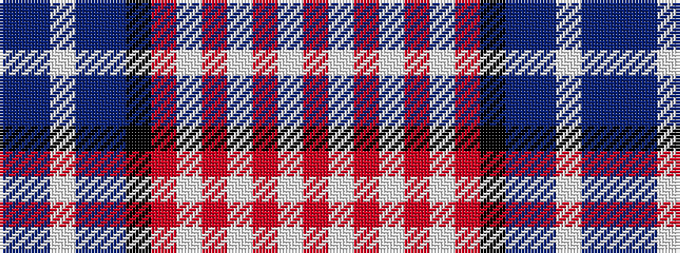

BBWBBKRWRWRWR

It is a 13 stripe tartan.

<figure class="pat-woven">

<figcaption>idealised sample</figcaption>
</figure>

## Colour Sequence



## Tartans with this colour sequence

| Tartans |
|---------------|
| [American Bi-Centennial](/setts/s13/db14t2w2t2db20k20r17w4r3w3r3w3r5~x2/)|
||
