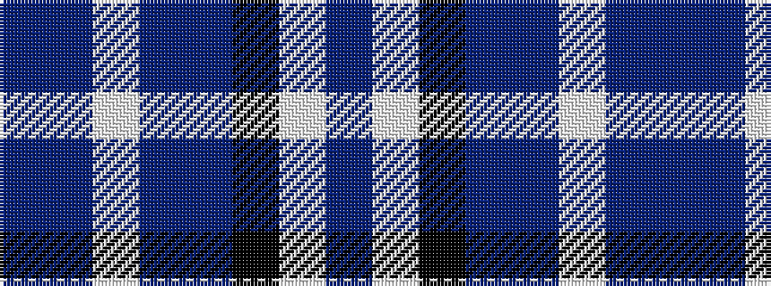

BBWBBKWB

It is a 8 stripe tartan.

<figure class="pat-woven">

<figcaption>idealised sample</figcaption>
</figure>

## Colour Sequence



## Tartans with this colour sequence

| Tartans |
|---------------|
| [Comrie, Navy Blue (Dance)](/setts/s8/dt42t2w2t2dt5k12w32db4~x2/)|
||
