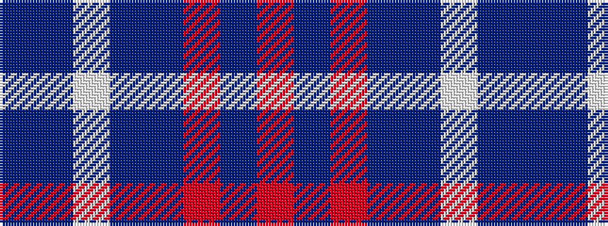

BBWBBRBR

It is a 8 stripe tartan.

<figure class="pat-woven">

<figcaption>idealised sample</figcaption>
</figure>

## Colour Sequence



## Tartans with this colour sequence

| Tartans |
|---------------|
| [Blue Rust](/setts/s8/db21n2w1n2db1r2db1o6~x4/)|
||
