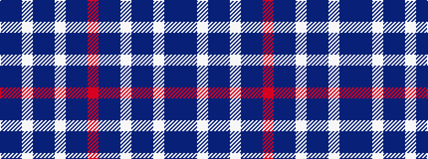

BBWBBWBBR

It is a 9 stripe tartan.

<figure class="pat-woven">

<figcaption>idealised sample</figcaption>
</figure>

## Colour Sequence



## Tartans with this colour sequence

| Tartans |
|---------------|
| [Callaway (Name)](/variants/s9/r4b12db36w4db4b16w3db6b3~x2/)|
||
