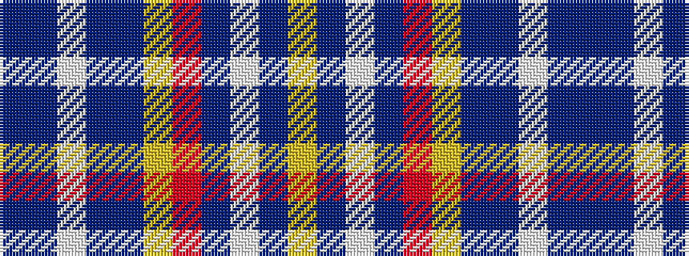

BBWBBYRBWBY

It is a 11 stripe tartan.

<figure class="pat-woven">

<figcaption>idealised sample</figcaption>
</figure>

## Colour Sequence



## Tartans with this colour sequence

| Tartans |
|---------------|
| [Cian Clan Irish Family Tartan](/variants/s11/t31dt4lb4t20dt8ly16r8t14lb4dt4lyi4/)|
||
| [Healy (Name)](/variants/s11/b9db2lb2b10db4ly8r4b7lb2db2ly2~x4/)|
||
