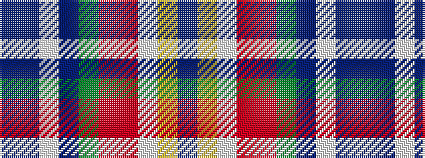

BBWBGRRWYB

It is a 10 stripe tartan.

<figure class="pat-woven">

<figcaption>idealised sample</figcaption>
</figure>

## Colour Sequence



## Tartans with this colour sequence

| Tartans |
|---------------|
| [Tau-Taurini (Provisional) (Personal)](/setts/s10/db64ly3w3r12r3g3dp3w3t10db10/)|
||
