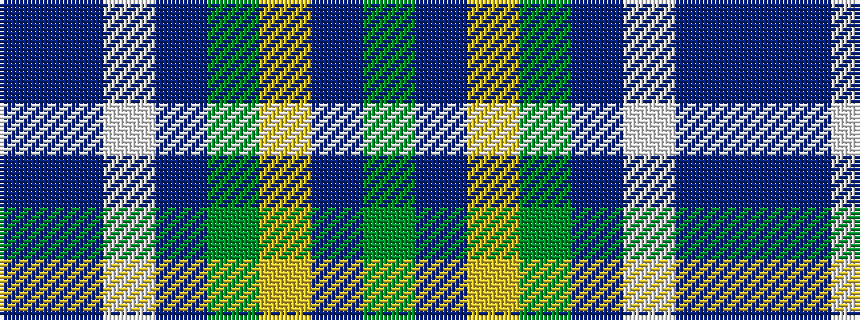

BBWBGYBG

It is a 8 stripe tartan.

<figure class="pat-woven">

<figcaption>idealised sample</figcaption>
</figure>

## Colour Sequence



## Tartans with this colour sequence

| Tartans |
|---------------|
| [Laurentian University](/setts/s8/dy2db4ly3dg28db28w2db4n2~x2/)|
||
