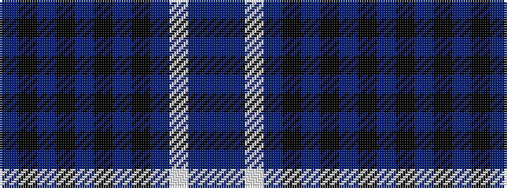

BBWBKBKBKBKB

It is a 12 stripe tartan.

<figure class="pat-woven">

<figcaption>idealised sample</figcaption>
</figure>

## Colour Sequence



## Tartans with this colour sequence

| Tartans |
|---------------|
| [Grampian Police](/variants/s12/dt5t2w1t2k32dt3k4dt29k2db1k3dt3~x2/)|
||
