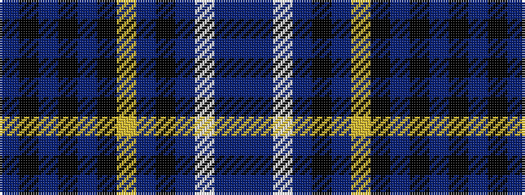

BBWBKBYKBKBKB

It is a 13 stripe tartan.

<figure class="pat-woven">

<figcaption>idealised sample</figcaption>
</figure>

## Colour Sequence



## Tartans with this colour sequence

| Tartans |
|---------------|
| [Silverton Family (Basingstoke)](/setts/s13/db4t1w1t1k29db3ly1k4db20k2db1k3db3~x2/)|
||
