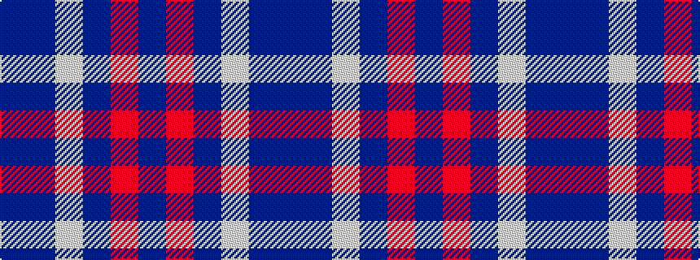

BBWBRB

It is a 6 stripe tartan.

<figure class="pat-woven">

<figcaption>idealised sample</figcaption>
</figure>

## Colour Sequence



## Tartans with this colour sequence

This pattern is a design lineage: every tartan below shares one colour order, whatever its owner —
near-identical designs are grouped, the largest lineage first (#112: the pattern is a tartan's
second parent, beside its family or clan).

<table class="sett-table">
<tbody>
<tr><td><a href="/variants/s6/db45dbi7w3dbi27r1dbi7~x2~db0805267-dbi1604274/">Edzell, U.S. Navy</a></td></tr>
<tr><td class="sett-swatch"></td></tr>
<tr><td><a href="/variants/s6/db51t8w4t30r1t9~x2/">Navy-Radar</a></td></tr>
<tr><td class="sett-swatch"></td></tr>
<tr><td><a href="/setts/db104dbi16w8dbi66r3dbi16/">US Navy Edzell</a></td></tr>
<tr><td class="sett-swatch"></td></tr>
<tr class="cluster-sep"><td></td></tr>
<tr><td><a href="/variants/s6/t23db18w5db2r14db18~x2/">Pitt (Glasgow)</a></td></tr>
<tr><td class="sett-swatch"></td></tr>
<tr><td><a href="/variants/s6/t136db45w7db4r4db16/">S.C.O.T.S</a></td></tr>
<tr><td class="sett-swatch"></td></tr>
<tr><td><a href="/setts/dbi55db18w3db2r2db6/">S.C.O.T.S.</a></td></tr>
<tr><td class="sett-swatch"></td></tr>
<tr class="cluster-sep"><td></td></tr>
<tr><td><a href="/variants/s6/dt45db7w3db27r1db7~x2/">U.S. Navy/Edzell (Military)</a></td></tr>
<tr><td class="sett-swatch"></td></tr>
</tbody>
</table>

