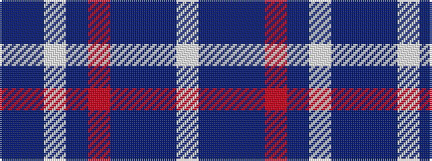

BBWBRBBBW

It is a 9 stripe tartan.

<figure class="pat-woven">

<figcaption>idealised sample</figcaption>
</figure>

## Colour Sequence



## Tartans with this colour sequence

| Tartans |
|---------------|
| [United States (Corporate)](/setts/s9/b7db5w6db5r7db2b2db70w2/)|
||
