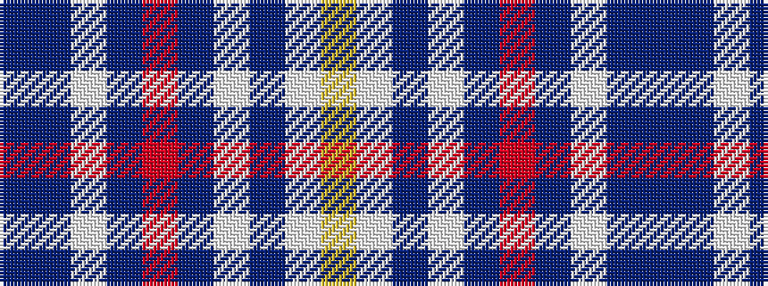

BBWBRBWBWY

It is a 10 stripe tartan.

<figure class="pat-woven">

<figcaption>idealised sample</figcaption>
</figure>

## Colour Sequence



## Tartans with this colour sequence

| Tartans |
|---------------|
| [Blue Toon](/setts/s10/n56db9w2db2r2n9lb4db2lb2ly3~x2/)|
||
