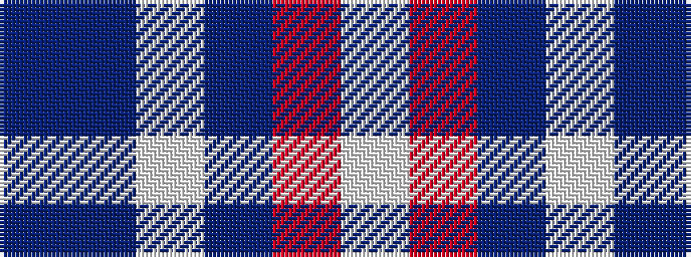

BBWBRW

It is a 6 stripe tartan.

<figure class="pat-woven">

<figcaption>idealised sample</figcaption>
</figure>

## Colour Sequence



## Tartans with this colour sequence

| Tartans |
|---------------|
| [Little's Chauffeur Drive](/setts/s6/db1n8w1db4m8w1~x6/)|
||
