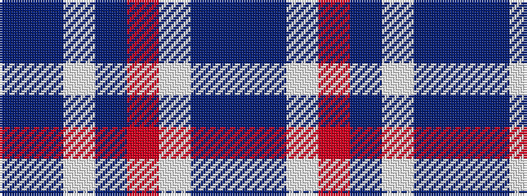

BBWBRWBB

It is a 8 stripe tartan.

<figure class="pat-woven">

<figcaption>idealised sample</figcaption>
</figure>

## Colour Sequence



## Tartans with this colour sequence

| Tartans |
|---------------|
| [Conquergood Family Tartan](/variants/s8/dt2t2w11t5o5w2dt1t2~x2/)|
||
