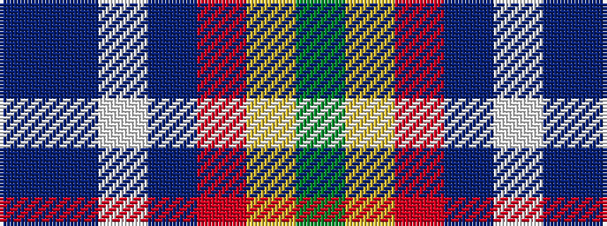

BBWBRYG

It is a 7 stripe tartan.

<figure class="pat-woven">

<figcaption>idealised sample</figcaption>
</figure>

## Colour Sequence



## Tartans with this colour sequence

| Tartans |
|---------------|
| [Wrigglesworth (Name)](/setts/s7/db30b10lb10db5m3ly3g3~x2/)|
||
