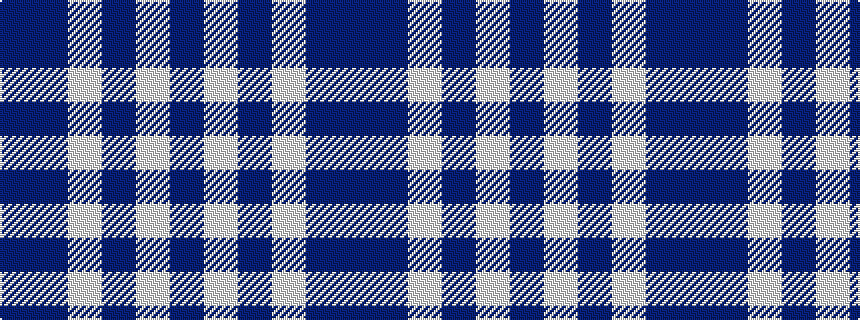

BBWBWB

It is a 6 stripe tartan.

<figure class="pat-woven">

<figcaption>idealised sample</figcaption>
</figure>

## Colour Sequence



## Tartans with this colour sequence

This pattern is a design lineage: every tartan below shares one colour order, whatever its owner —
near-identical designs are grouped, the largest lineage first (#112: the pattern is a tartan's
second parent, beside its family or clan).

<table class="sett-table">
<tbody>
<tr><td><a href="/variants/s6/db128dr8lb41dt4lb4dt4/">French Freemasons' Pride</a></td></tr>
<tr><td class="sett-swatch"></td></tr>
<tr class="cluster-sep"><td></td></tr>
<tr><td><a href="/variants/s6/t52db28w3db2w2db10~x2/">St Andrews Earl of Royal family Tartan</a></td></tr>
<tr><td class="sett-swatch"></td></tr>
<tr class="cluster-sep"><td></td></tr>
<tr><td><a href="/variants/s6/dr2lb2n18lb1n2db2~x4/">St. Giles Cathedral (Corporate)</a></td></tr>
<tr><td class="sett-swatch"></td></tr>
<tr class="cluster-sep"><td></td></tr>
<tr><td><a href="/variants/s6/db144dr9lb44db4lb4db4/">United French Freemasons (Corporate</a></td></tr>
<tr><td class="sett-swatch"></td></tr>
</tbody>
</table>

