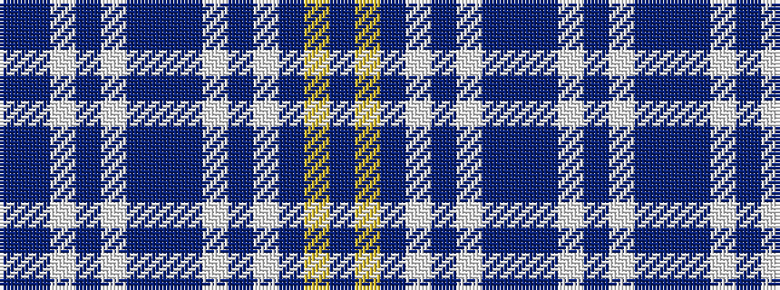

BBWBWBBBWBWBYB

It is a 14 stripe tartan.

<figure class="pat-woven">

<figcaption>idealised sample</figcaption>
</figure>

## Colour Sequence



## Tartans with this colour sequence

| Tartans |
|---------------|
| [Worsoff (Personal)](/setts/s14/b32db1w2b1w2db1b32db1w2db1w2db1ly5db1~x2/)|
||
