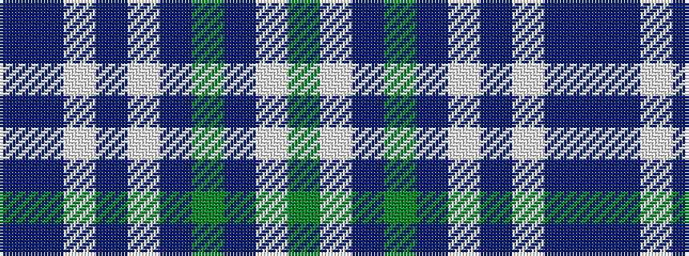

BBWBWBGBWG

It is a 10 stripe tartan.

<figure class="pat-woven">

<figcaption>idealised sample</figcaption>
</figure>

## Colour Sequence



## Tartans with this colour sequence

| Tartans |
|---------------|
| [Head of The Lakes](/setts/s10/g7lb2db28dg14dp5lb2dp5lb2db27b2~x2/)|
||
