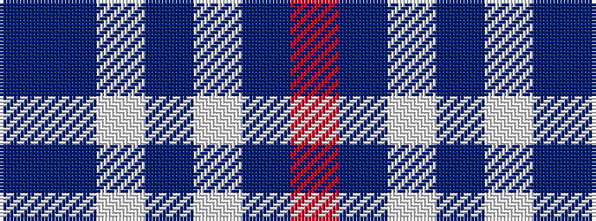

BBWBWBR

It is a 7 stripe tartan.

<figure class="pat-woven">

<figcaption>idealised sample</figcaption>
</figure>

## Colour Sequence



## Tartans with this colour sequence

| Tartans |
|---------------|
| [North Tyneside Pipe Band](/setts/s7/b62db22w3db2w2db3r1~x2/)|
||
