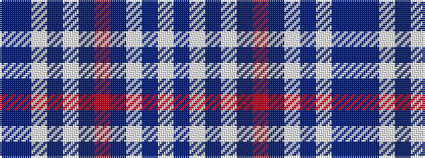

BBWBWBRBWBWB

It is a 12 stripe tartan.

<figure class="pat-woven">

<figcaption>idealised sample</figcaption>
</figure>

## Colour Sequence



## Tartans with this colour sequence

| Tartans |
|---------------|
| [Tyneside Blue Corporate Tartan](/variants/s12/b62db22w3db2w2db3r1~x2/)|
||
