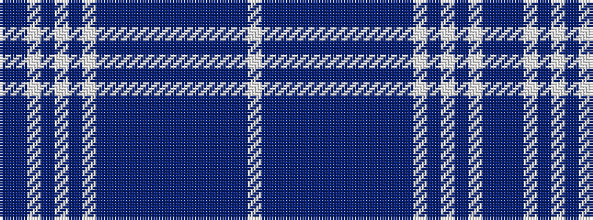

BBWBWBWBBBBBBBBBBBW

It is a 19 stripe tartan.

<figure class="pat-woven">

<figcaption>idealised sample</figcaption>
</figure>

## Colour Sequence



## Tartans with this colour sequence

| Tartans |
|---------------|
| [Finnish](/setts/s19/w8dt1db24dt2db1dt2db4dt2db1dt2db4dt1w4db2w1db2w20dt1db5~x2/)|
||
