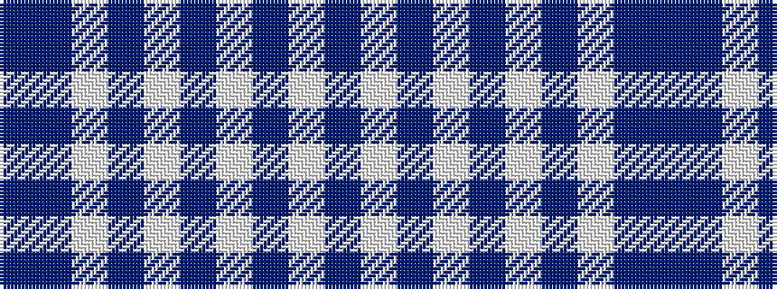

BBWBWBWBWB

It is a 10 stripe tartan.

<figure class="pat-woven">

<figcaption>idealised sample</figcaption>
</figure>

## Colour Sequence



## Tartans with this colour sequence

| Tartans |
|---------------|
| [St. Andrews, Earl of](/setts/s10/b52db28w5db3w2db10~x2/)|
||
