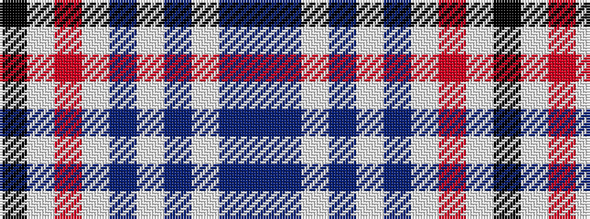

BBWBWBWRWK

It is a 10 stripe tartan.

<figure class="pat-woven">

<figcaption>idealised sample</figcaption>
</figure>

## Colour Sequence



## Tartans with this colour sequence

| Tartans |
|---------------|
| [Xain (Personal)](/setts/s10/t63dp21w16dp2w4dp4w12o6w16k21~x2/)|
||
