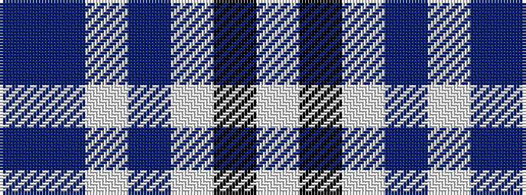

BBWBWKW

It is a 7 stripe tartan.

<figure class="pat-woven">

<figcaption>idealised sample</figcaption>
</figure>

## Colour Sequence



## Tartans with this colour sequence

| Tartans |
|---------------|
| [MacPherson Dress Purple](/setts/s7/w5k3w31dp26w4dp10t4~x2/)|
||
| [MacPherson Turquoise Dress Tartan Tartan Number: 8183. Earliest known date: Threadcount and colours aren't 100% original. Generated manually. See products available Copyright © Blair Urquhart, Comrie, 2015](/setts/s7/w4k2w26t23w3t8p3~x2/)|
||
| [MacPherson, dress (purple)](/setts/s7/w5k3w31p26w4p10t4~x2/)|
||
