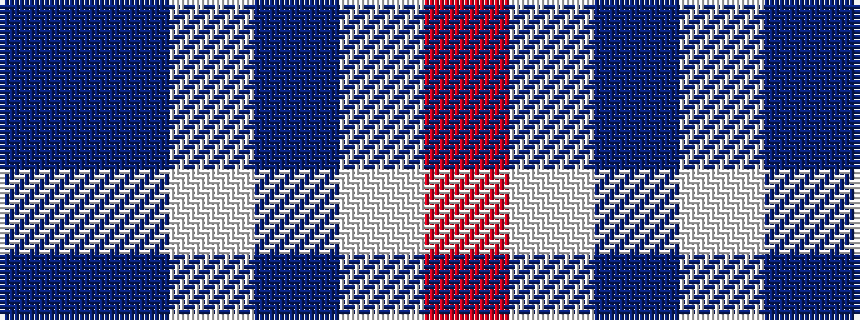

BBWBWR

It is a 6 stripe tartan.

<figure class="pat-woven">

<figcaption>idealised sample</figcaption>
</figure>

## Colour Sequence



## Tartans with this colour sequence

| Tartans |
|---------------|
| [St. Giles Cathedral (Corporate)](/variants/s6/db2n2lb1n18lb2r2~x4/)|
||
