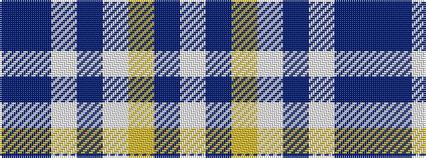

BBWBWYBW

It is a 8 stripe tartan.

<figure class="pat-woven">

<figcaption>idealised sample</figcaption>
</figure>

## Colour Sequence



## Tartans with this colour sequence

| Tartans |
|---------------|
| [Parkin](/variants/s8/w3dt9ly1lb3dp9lb1dt40dp2~x2/)|
||
