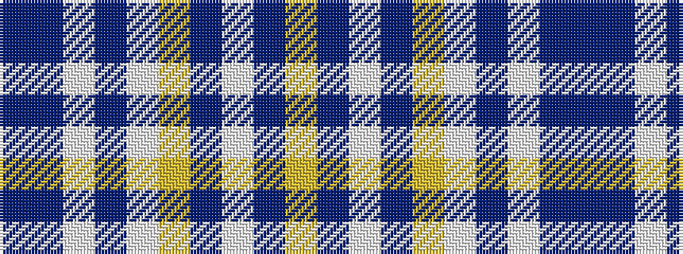

BBWBWYBWBY

It is a 10 stripe tartan.

<figure class="pat-woven">

<figcaption>idealised sample</figcaption>
</figure>

## Colour Sequence



## Tartans with this colour sequence

| Tartans |
|---------------|
| [Stewart Navy Clan Tartan Tartan Number: 1117. Earliest known date: 1971 Stewart Navy See products available Copyright © Blair Urquhart, Comrie, 2015](/setts/s10/dt29dr3w10dt2w2lo10dt5w2dt4lo2~x2/)|
||
