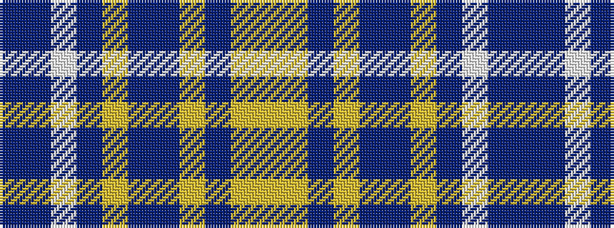

BBWBYBBYBYY

It is a 11 stripe tartan.

<figure class="pat-woven">

<figcaption>idealised sample</figcaption>
</figure>

## Colour Sequence



## Tartans with this colour sequence

| Tartans |
|---------------|
| [Blue Toon (Fashion)](/setts/s11/t49dt11w2dt2lr2dt2t10lg4dt2lg2ly3~x2/)|
||
