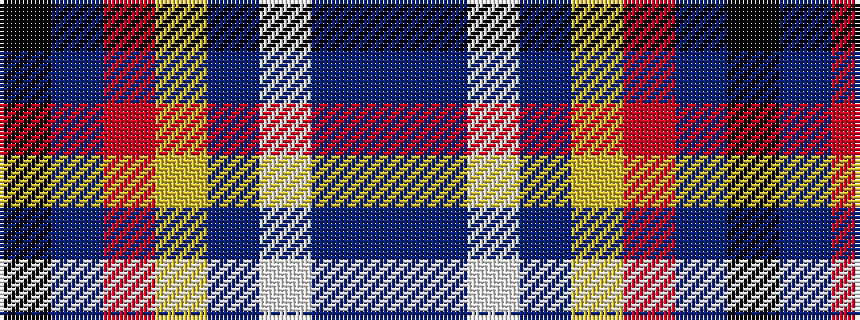

BBWBYRBK

It is a 8 stripe tartan.

<figure class="pat-woven">

<figcaption>idealised sample</figcaption>
</figure>

## Colour Sequence



## Tartans with this colour sequence

| Tartans |
|---------------|
| [Julien Pigeut Tartan](/variants/s8/k40n15o10ly3t5w5db10t20/)|
||
