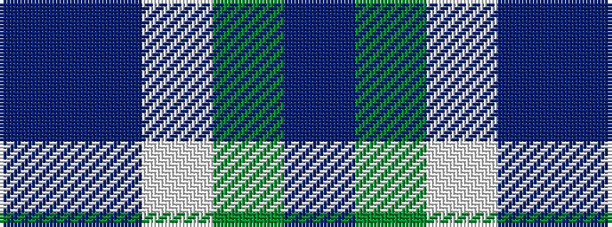

BBWGB

It is a 5 stripe tartan.

<figure class="pat-woven">

<figcaption>idealised sample</figcaption>
</figure>

## Colour Sequence



## Tartans with this colour sequence

| Tartans |
|---------------|
| [Cathro](/setts/s5/dp9db6w1dg4dp2~x4/)|
||
| [Cathro (Name)](/setts/s5/p9b6w1g4p2~x8/)|
||
