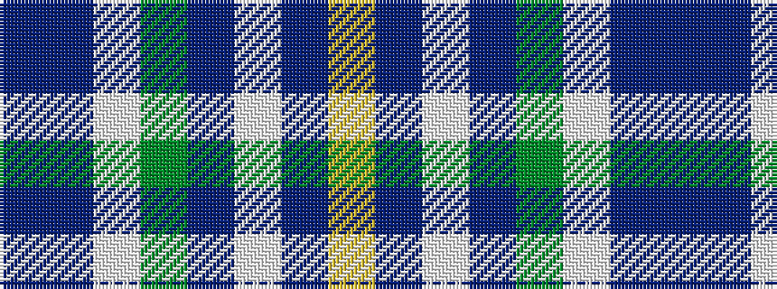

BBWGBWBY

It is a 8 stripe tartan.

<figure class="pat-woven">

<figcaption>idealised sample</figcaption>
</figure>

## Colour Sequence



## Tartans with this colour sequence

| Tartans |
|---------------|
| [Blue Ridge Highlands Heritage](/setts/s8/t27db9lb3g6db33lb3dr3ly2~x2/)|
||
