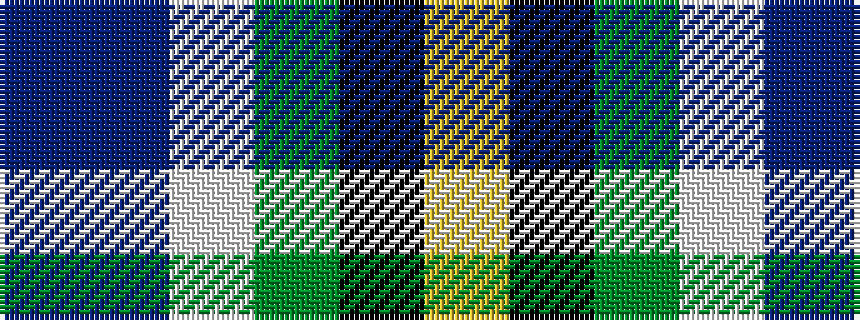

BBWGKY

It is a 6 stripe tartan.

<figure class="pat-woven">

<figcaption>idealised sample</figcaption>
</figure>

## Colour Sequence



## Tartans with this colour sequence

| Tartans |
|---------------|
| [MacBlain (2016)](/setts/s6/db5dp3w2dg3k1ly1~x10/)|
||
