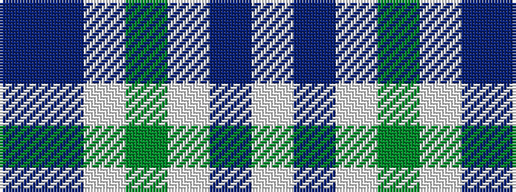

BBWGWBW

It is a 7 stripe tartan.

<figure class="pat-woven">

<figcaption>idealised sample</figcaption>
</figure>

## Colour Sequence



## Tartans with this colour sequence

| Tartans |
|---------------|
| [Newall (Dumbarton) (Personal)](/setts/s7/t30dp15w4dg12w9t8w3~x2/)|
||
| [Newall (Personal)](/setts/s7/b30dt15lb4dg12lb9b8lb3~x2/)|
||
