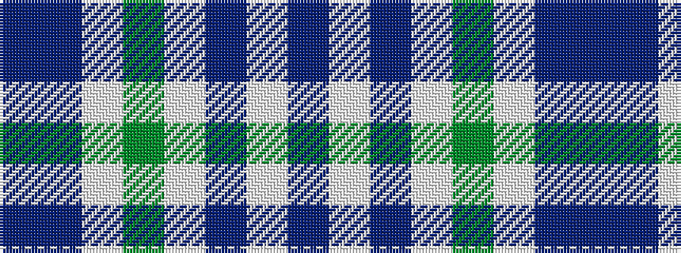

BBWGWBWB

It is a 8 stripe tartan.

<figure class="pat-woven">

<figcaption>idealised sample</figcaption>
</figure>

## Colour Sequence



## Tartans with this colour sequence

| Tartans |
|---------------|
| [Chaudhri, Zafar Iqbal](/variants/s8/dp13n8w5dg24w5n10w5n10~x2/)|
||
