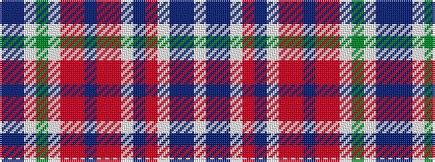

BBWGWRRBRRWBRWBBW

It is a 17 stripe tartan.

<figure class="pat-woven">

<figcaption>idealised sample</figcaption>
</figure>

## Colour Sequence



## Tartans with this colour sequence

| Tartans |
|---------------|
| [Birral/Burrell](/setts/s17/t4dp8w2g32w2r8ri4dp2ri4r8w2dp16r65w2dp8t4w2~x2/)|
||
