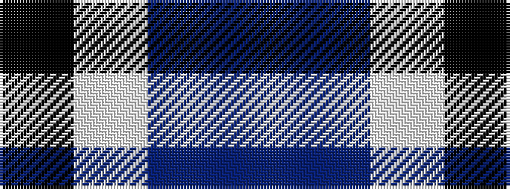

BBWK

It is a 4 stripe tartan.

<figure class="pat-woven">

<figcaption>idealised sample</figcaption>
</figure>

## Colour Sequence



## Tartans with this colour sequence

| Tartans |
|---------------|
| [Murdoch, Ellis (Personal)](/variants/s4/p20db25w3k2~x2/)|
||
| [Murdoch, Ellis (Personal)](/variants/s4/dp20db25w3k2~x2/)|
||
