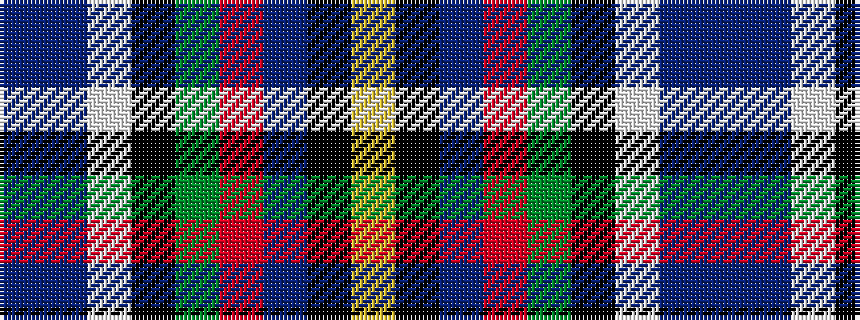

BBWKGRBKY

It is a 9 stripe tartan.

<figure class="pat-woven">

<figcaption>idealised sample</figcaption>
</figure>

## Colour Sequence



## Tartans with this colour sequence

| Tartans |
|---------------|
| [Wilson's, No 110](/variants/s9/t3p10w3k3g19r14t3k2ly3~x2/)|
||
