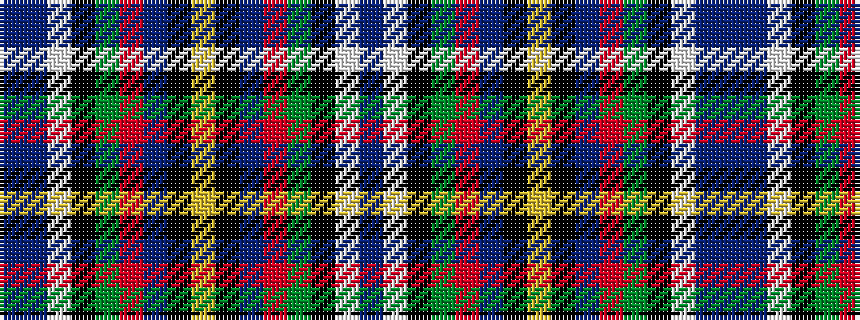

BBWKGRBKYKBRGKWB

It is a 16 stripe tartan.

<figure class="pat-woven">

<figcaption>idealised sample</figcaption>
</figure>

## Colour Sequence



## Tartans with this colour sequence

| Tartans |
|---------------|
| [Wilson's No.110](/setts/s16/dp10w3k3g19r14t3k2ly3k2t3r14g19k3w3dp10t3~x2/)|
||
