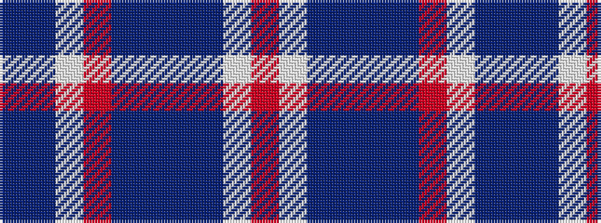

BBWRBBBBWR

It is a 10 stripe tartan.

<figure class="pat-woven">

<figcaption>idealised sample</figcaption>
</figure>

## Colour Sequence



## Tartans with this colour sequence

| Tartans |
|---------------|
| [Mortell (Personal)](/setts/s10/db20b2w5r2db10b5db20b2w5r5~x2/)|
||
| [Mortell (Personal)](/setts/s10/n20t2w5r2n10t5n20t2w5r5~x2/)|
||
