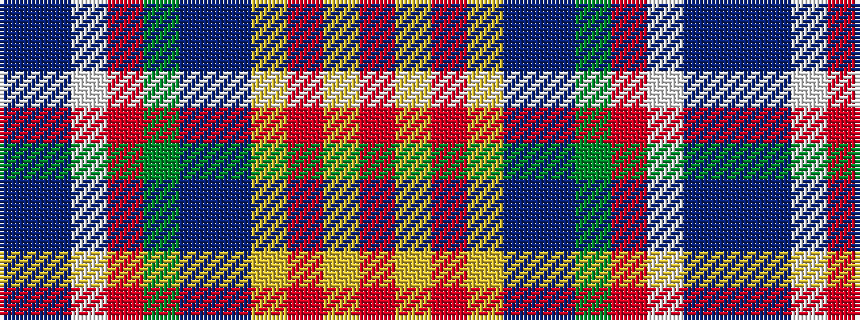

BBWRGBBYRYR

It is a 11 stripe tartan.

<figure class="pat-woven">

<figcaption>idealised sample</figcaption>
</figure>

## Colour Sequence



## Tartans with this colour sequence

| Tartans |
|---------------|
| [Doig (Personal)](/variants/s11/r52ly2r1ly2t8db4g18r11w2db5t8~x2/)|
||
