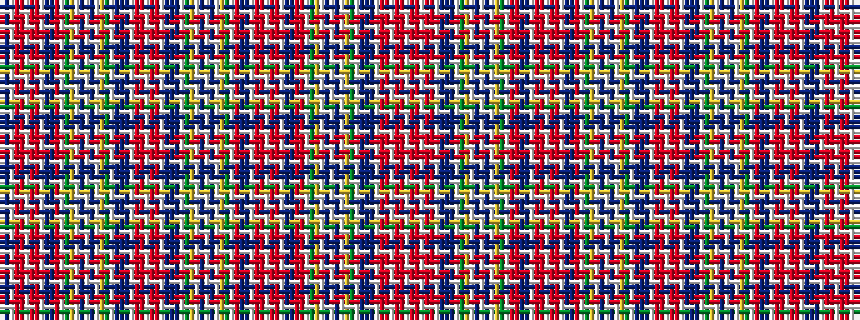

BBWRRWRRWBBRWGYWBWBWYGWBBBWRRWRRWBBBWGYWBWBWYGWRBBWRRWRRWBBRRWGYWBWBWYGWBBBWRRWRRW

It is a 82 stripe tartan.

<figure class="pat-woven">

<figcaption>idealised sample</figcaption>
</figure>

## Colour Sequence



## Tartans with this colour sequence

| Tartans |
|---------------|
| [Unnamed C18th - Cant Counts](/setts/s82/db10t3w1ri6r12w1r12ri6w1t3db10r6w1dg10ly6w1t2w1t2w1ly6dg10w1t3db10t3w1ri5r6w1r6ri5w1t3db10t3w1dg10ly6w1t2w1t2w1ly6dg10w1r6db10t3w1ri6r12w1r12ri6w1t3db10r6ri5w1dg10ly6w1t2w1t2w1ly6dg10w1t3db10t3w1ri5r6-hf19a0654fe85c6ae/)|
||
