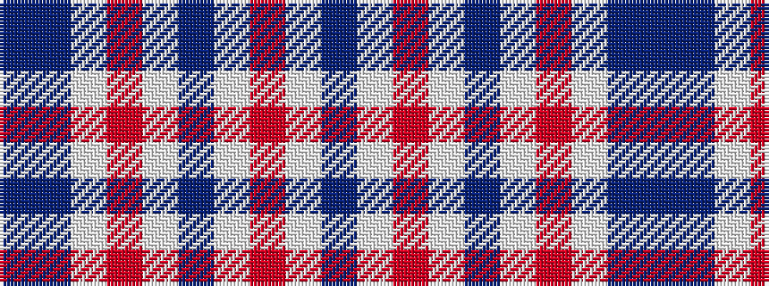

BBWRWBWRWB

It is a 10 stripe tartan.

<figure class="pat-woven">

<figcaption>idealised sample</figcaption>
</figure>

## Colour Sequence



## Tartans with this colour sequence

| Tartans |
|---------------|
| [Vetoclock](/setts/s10/n110lp3o14w1dp10w1o6lp3dp4n2~x2/)|
||
