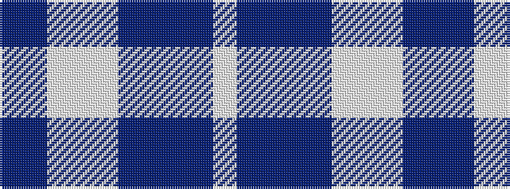

BBWWWBBBBW

It is a 10 stripe tartan.

<figure class="pat-woven">

<figcaption>idealised sample</figcaption>
</figure>

## Colour Sequence



## Tartans with this colour sequence

| Tartans |
|---------------|
| [Saltire (Fashion)](/setts/s10/db10b6lb6w4lb3b6db20b46db2lb2~x2/)|
||
