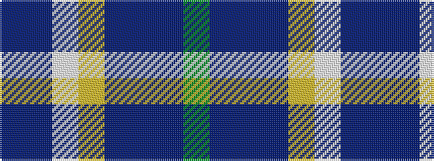

BBWYBBBG

It is a 8 stripe tartan.

<figure class="pat-woven">

<figcaption>idealised sample</figcaption>
</figure>

## Colour Sequence



## Tartans with this colour sequence

| Tartans |
|---------------|
| [Scotia](/setts/s8/g6dp14b22db6lo16w1db6b6~x2/)|
||
