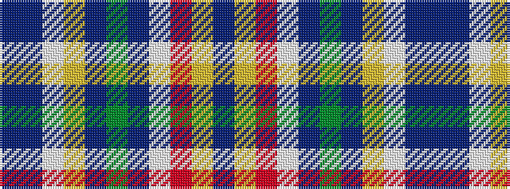

BBWYBGBWRYB

It is a 11 stripe tartan.

<figure class="pat-woven">

<figcaption>idealised sample</figcaption>
</figure>

## Colour Sequence



## Tartans with this colour sequence

| Tartans |
|---------------|
| [Colours of Hope](/setts/s11/dt3db28w2ly2db1dg4dt8w3r4ly10dt2~x2/)|
||
