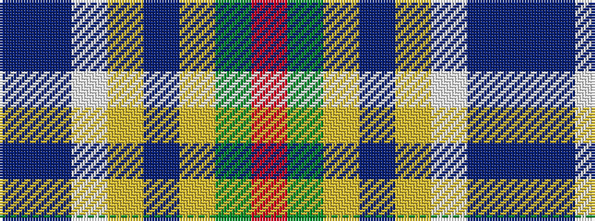

BBWYBYGR

It is a 8 stripe tartan.

<figure class="pat-woven">

<figcaption>idealised sample</figcaption>
</figure>

## Colour Sequence



## Tartans with this colour sequence

| Tartans |
|---------------|
| [Curd (2013)](/variants/s8/db1t9w3ly3db9ly1g1r1~x4/)|
||
