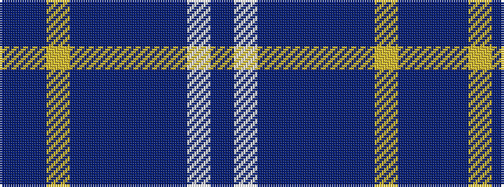

BBYBBBBBWB

It is a 10 stripe tartan.

<figure class="pat-woven">

<figcaption>idealised sample</figcaption>
</figure>

## Colour Sequence



## Tartans with this colour sequence

| Tartans |
|---------------|
| [Serenade (Fashion)](/setts/s10/db6dp12lg3dp12b6db2b26dp16lb2dp6~x2/)|
||
