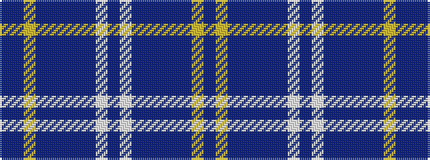

BBYBBBBBWBWBBBBBYB

It is a 18 stripe tartan.

<figure class="pat-woven">

<figcaption>idealised sample</figcaption>
</figure>

## Colour Sequence



## Tartans with this colour sequence

| Tartans |
|---------------|
| [Serenade](/variants/s18/dp12lg3dp12b6db2b26dp16lb2dp6lb2dp16b26db2b6dp12lg3dp12db6~x2/)|
||
