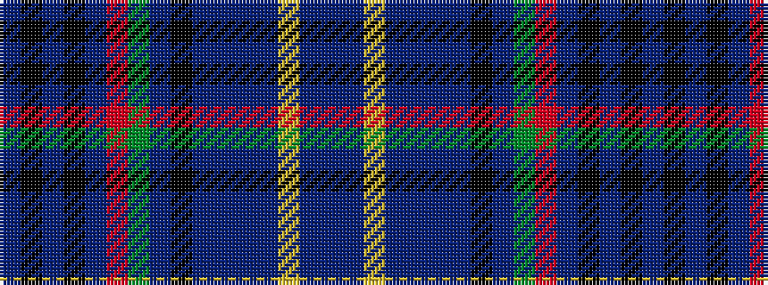

BBYBBBBKBGRBKBKB

It is a 16 stripe tartan.

<figure class="pat-woven">

<figcaption>idealised sample</figcaption>
</figure>

## Colour Sequence



## Tartans with this colour sequence

| Tartans |
|---------------|
| [Westminster College](/variants/s16/db2k2db2k21db2r2g21db2k2db2t2db21db21lr1db21t2~x2/)|
||
