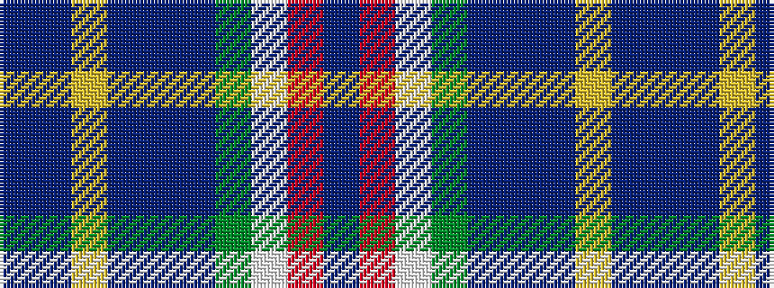

BBYBBBGWRB

It is a 10 stripe tartan.

<figure class="pat-woven">

<figcaption>idealised sample</figcaption>
</figure>

## Colour Sequence



## Tartans with this colour sequence

| Tartans |
|---------------|
| [Corryvrechan Dress (Corporate)](/variants/s10/t40db12ly2db2t2db2g6w21r2t2~x2/)|
||
